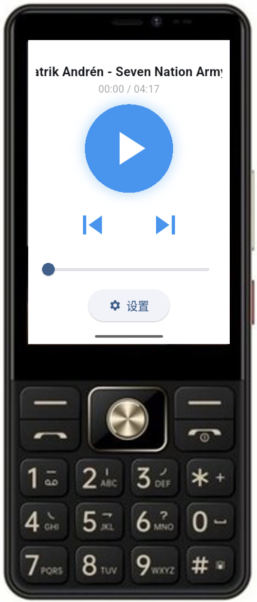

# 外婆音乐 (Nanny Player)

<div align="center">


一个为老年机设计的简洁音乐播放器，优化适配 `酷派金世纪 Y60`、`TCL T50N`、`以晴 Q968`、`百合 A89`等 480x320 分辨率的 Android 系统老年机。

[](README_EN.md)
[](LICENSE)
[](https://flutter.dev)
[](https://www.android.com/)

[功能特性](#功能特性) • [界面展示](#界面展示) • [使用方法](#使用方法) • [安装说明](#安装说明) • [开发文档](#开发文档)

</div>

## 功能特性

### 🎯 适老化设计

- **超大按钮**: 播放/暂停按钮尺寸达 140x140 像素，方便老年人点击
- **简洁界面**: 无复杂功能，直接进入播放页面，操作简单直观
- **大字体**: 所有文本使用加大字体（18-20px），易于阅读
- **高对比度**: 蓝白配色方案，清晰醒目
- **自动滚动**: 长歌曲名自动横向滚动显示，不会被截断

### 🕹️ 实体按键适配

完整支持 Android 方向键（Directional Buttons）操作：

- **确定键（中间）**: 播放/暂停
- **左键**: 上一曲
- **右键**: 下一曲
- **上键**: 音量增加（每次 +10%）
- **下键**: 音量减少（每次 -10%）

> 特别适合配备物理方向键的老年机型，如 `金世纪 Y60`、`TCL T50N`、`以晴 Q968`、`百合 A89` 等

### 🎵 核心播放功能

- **播放控制**: 播放/暂停、上一曲、下一曲
- **音量调节**: 调节系统音量，显示音量百分比提示
- **进度显示**: 实时显示播放进度和总时长（00:00 / 00:00 格式）
- **播放模式**:
  - 顺序播放：按文件名顺序循环播放
  - 随机播放：使用 Fisher-Yates 洗牌算法随机播放
  
### 💾 智能存储功能

- **断点续播**: 自动保存播放进度，再次打开恢复到上次位置
- **状态持久化**: 保存播放列表、当前歌曲、播放进度、随机模式状态
- **后台保存**: App进入后台时自动暂停并保存进度

## 界面展示

### 主界面
<div align="center">

</div>

界面简洁清晰，专为 480x320 分辨率优化：
- 顶部显示歌曲名称和播放时间
- 中间超大播放/暂停按钮
- 下方上一曲/下一曲控制
- 底部进度条和设置入口

## 使用方法

### 首次使用

1. 打开 App 后，点击底部的「设置」按钮
2. 点击「选择音乐文件」按钮
3. 从设备存储中选择音乐文件（支持多选）
4. 选择完成后返回，音乐自动开始播放

### 日常操作

#### 触屏操作
- **播放/暂停**: 点击中间的超大圆形按钮
- **切换歌曲**: 点击下方的上一曲/下一曲按钮
- **调整进度**: 拖动进度条到想要的位置
- **更换音乐**: 点击设置按钮，重新选择音乐文件
- **切换模式**: 在设置中开关「随机播放」

#### 实体按键操作
- **播放/暂停**: 按确定键（中间键）
- **上一曲**: 按左键
- **下一曲**: 按右键
- **增加音量**: 按上键
- **减少音量**: 按下键

### 自动功能

- 退出 App 时自动暂停并保存进度
- 再次打开 App 时自动恢复到上次播放的歌曲和位置
- 歌曲播放完毕自动播放下一曲
- 长歌曲名自动滚动显示
- App 进入后台自动暂停播放

## 安装说明

### 方式一：安装预编译 APK（推荐）

1. 从 [Releases](https://github.com/MiQieR/NannyPlayer/releases) 页面下载最新版本的 APK
2. 将 APK 传输到 Android 设备
3. 在设备上打开 APK 文件进行安装
4. 首次安装可能需要在设置中允许「未知来源」的应用

### 方式二：从源码编译

**前置要求**
- Flutter SDK 3.9.2 或更高版本
- Android SDK (minSdkVersion: 21)
- Dart SDK

**编译步骤**

1. 克隆仓库
```bash
git clone https://github.com/MiQieR/NannyPlayer.git
cd NannyPlayer
```

2. 安装依赖
```bash
flutter pub get
```

3. 生成应用图标
```bash
dart run flutter_launcher_icons
```

4. 构建 APK
```bash
flutter build apk --release
```

5. 生成的 APK 位于 `build/app/outputs/flutter-apk/app-release.apk`

## 开发文档

### 技术栈

| 技术 | 版本 | 用途 |
|------|------|------|
| Flutter | ^3.9.2 | UI 框架 |
| Dart | ^3.0.0 | 编程语言 |
| just_audio | ^0.9.46 | 高质量音频播放引擎 |
| shared_preferences | ^2.5.3 | 本地键值对存储 |
| file_picker | ^8.1.6 | 文件选择器 |
| path_provider | ^2.1.5 | 路径访问 |
| volume_controller | ^2.0.7 | 系统音量控制 |
| marquee | ^2.2.3 | 文本滚动显示 |
| flutter_launcher_icons | ^0.14.1 | 应用图标生成 |

### Android 权限

应用需要以下权限：

```xml
<!-- 读取音频文件 -->
<uses-permission android:name="android.permission.READ_EXTERNAL_STORAGE" android:maxSdkVersion="32" />
<uses-permission android:name="android.permission.READ_MEDIA_AUDIO" />

<!-- 播放时保持设备唤醒 -->
<uses-permission android:name="android.permission.WAKE_LOCK" />

<!-- 后台播放支持 -->
<uses-permission android:name="android.permission.FOREGROUND_SERVICE" />
```

### 核心架构

**单文件架构设计**
- 整个应用仅使用一个 Dart 文件 (`main.dart`)
- 包含 4 个页面类：`NannyPlayerApp`、`PlayerPage`、`SettingsPage`、`AboutPage`
- 使用 `StatefulWidget` 管理 UI 状态
- 使用 `WidgetsBindingObserver` mixin 监听应用生命周期

**状态管理**
- 使用 `setState()` 进行 UI 状态更新
- 使用 `SharedPreferences` 进行数据持久化
- 使用 Stream 监听音频播放状态

**播放器逻辑**
- 使用 `just_audio` 的 `AudioPlayer` 类
- 监听 `playerStateStream`、`positionStream`、`durationStream`
- 实现 Fisher-Yates 洗牌算法用于随机播放

### 代码规范

- 通过 `flutter analyze` 静态分析（0 个问题）
- 遵循 Dart 官方代码风格指南
- 使用 `flutter_lints ^5.0.0` 进行代码检查

## 注意事项

1. **权限授予**: 首次使用时需要授予存储权限，用于读取音乐文件
2. **平台支持**: 仅支持 Android 平台，针对竖屏设备优化
3. **屏幕尺寸**: 界面专为 480x320 分辨率优化，其他分辨率可能需要调整
4. **屏幕方向**: 强制锁定竖屏方向，不支持横屏显示
5. **音频格式**: 支持 Android 系统支持的所有音频格式（MP3、AAC、FLAC 等）
6. **文件选择**: 使用系统文件选择器，支持批量选择多个文件

## 开源协议

本项目采用 [MIT License](LICENSE) 开源协议。

## 贡献

欢迎提交 Issue 和 Pull Request！

如果你有任何建议或发现了 Bug，请在 [Issues](https://github.com/MiQieR/NannyPlayer/issues) 页面提出。

---

<div align="center">
Made with ❤️ for elderly users
</div>
